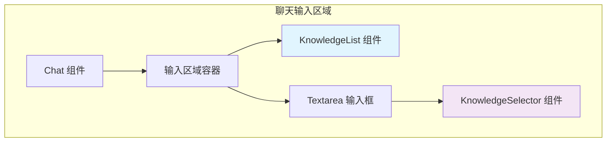
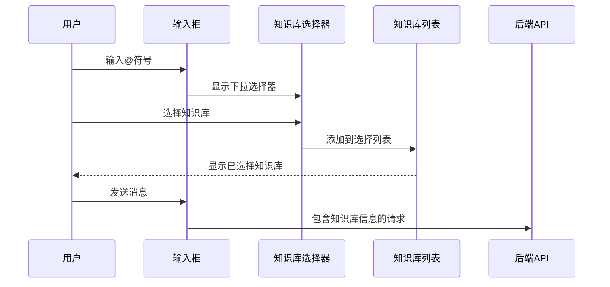
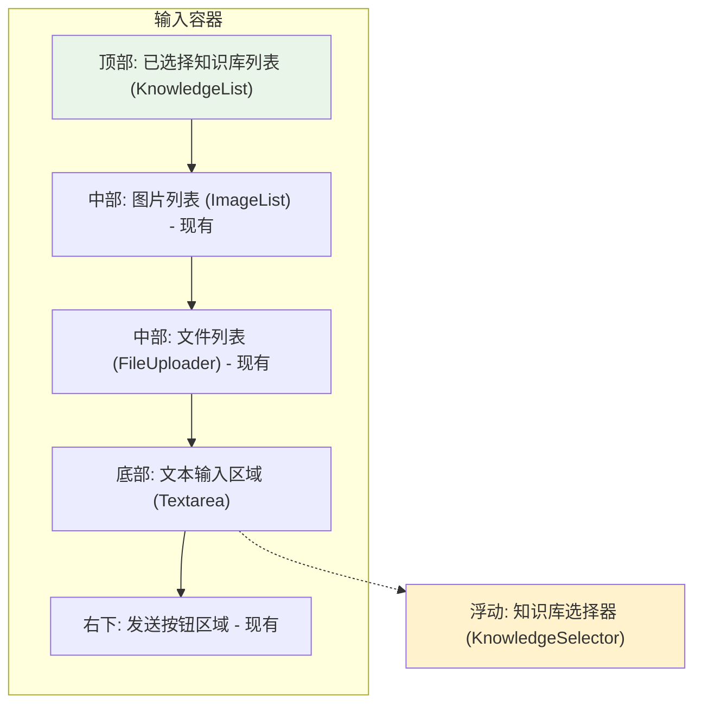

# 对话知识库选择组件设计

## 概述

本设计文档描述了在对话框输入区域增加知识库选择功能的组件。该组件允许用户通过@符号触发下拉选择器来选择当前对话使用的知识库，类似于ImageList的展示方式在输入框上方显示已选择的知识库，并在消息发送时将选择的知识库信息传递给后端。

## 技术栈与依赖

- **React**: 函数式组件与Hooks
- **TypeScript**: 类型安全的开发体验  
- **Tailwind CSS**: 样式系统
- **@headlessui/react**: 无样式UI组件库（下拉选择器）
- **rc-textarea**: 文本输入组件
- **react-i18next**: 国际化支持

## 组件架构

### 核心组件设计

#### KnowledgeList 组件
展示已选择知识库的列表组件，类似于ImageList的设计模式。

**组件属性**:
```typescript
type KnowledgeItem = {
  id: string
  name: string
  description?: string
  color?: string // 知识库标识颜色
}

type KnowledgeListProps = {
  list: KnowledgeItem[]
  readonly?: boolean
  onRemove?: (knowledgeId: string) => void
  maxDisplay?: number // 最大显示数量
}
```

**功能特性**:
- 水平排列显示已选择的知识库
- 支持删除操作（非readonly模式）
- 显示知识库名称和标识颜色
- 超出显示数量时显示"更多"提示

#### KnowledgeSelector 组件  
知识库下拉选择器，基于现有Select组件扩展。

**组件属性**:
```typescript
type KnowledgeSelectorProps = {
  knowledgeList: KnowledgeItem[]
  selectedKnowledge: KnowledgeItem[]
  onSelect: (knowledge: KnowledgeItem) => void
  className?: string
  placeholder?: string
}
```

**功能特性**:
- 基于@符号触发的下拉选择
- 支持搜索过滤知识库
- 防止重复选择同一知识库
- 自动关闭选择器

### 组件层次结构



### 状态管理

#### 状态定义
```typescript
// 在Chat组件中添加的状态
const [selectedKnowledge, setSelectedKnowledge] = useState<KnowledgeItem[]>([])
const [showKnowledgeSelector, setShowKnowledgeSelector] = useState(false)
const [selectorPosition, setSelectorPosition] = useState({ top: 0, left: 0 })
```

#### 状态流转



## 详细实现设计

### 输入处理逻辑

#### @符号触发逻辑
```typescript
const handleInputChange = (e: ChangeEvent<HTMLTextAreaElement>) => {
  const value = e.target.value
  const cursorPosition = e.target.selectionStart
  
  // 检查光标前的字符是否为@
  if (value[cursorPosition - 1] === '@') {
    const rect = e.target.getBoundingClientRect()
    // 计算选择器位置
    setSelectorPosition({
      top: rect.bottom + window.scrollY,
      left: rect.left + window.scrollX
    })
    setShowKnowledgeSelector(true)
  }
  
  setQuery(value)
  queryRef.current = value
}
```

#### 键盘事件处理
```typescript
const handleKeyDown = (e: KeyboardEvent<HTMLTextAreaElement>) => {
  // ESC键关闭选择器
  if (e.key === 'Escape' && showKnowledgeSelector) {
    setShowKnowledgeSelector(false)
    e.preventDefault()
  }
  
  // 其他原有逻辑...
}
```

### 知识库管理逻辑

#### 添加知识库
```typescript
const handleSelectKnowledge = (knowledge: KnowledgeItem) => {
  // 检查是否已存在
  if (!selectedKnowledge.find(k => k.id === knowledge.id)) {
    setSelectedKnowledge(prev => [...prev, knowledge])
  }
  setShowKnowledgeSelector(false)
}
```

#### 移除知识库
```typescript
const handleRemoveKnowledge = (knowledgeId: string) => {
  setSelectedKnowledge(prev => prev.filter(k => k.id !== knowledgeId))
}
```

### 发送消息集成

#### 发送消息时包含知识库信息
```typescript
const handleSend = () => {
  if (!valid() || (checkCanSend && !checkCanSend()))
    return
    
  // 准备文件数组（现有逻辑）
  const imageFiles: VisionFile[] = files.filter(file => file.progress !== -1).map(fileItem => ({
    type: 'image',
    transfer_method: fileItem.type,
    url: fileItem.url,
    upload_file_id: fileItem.fileId,
  }))
  const docAndOtherFiles: VisionFile[] = getProcessedFiles(attachmentFiles)
  const combinedFiles: VisionFile[] = [...imageFiles, ...docAndOtherFiles]
  
  // 发送消息，知识库信息通过全局inputs传递
  onSend(queryRef.current, combinedFiles)
  
  // 清理状态...
}
```

#### 知识库信息传递方式
知识库选择信息将在发送消息时通过修改全局的inputs参数传递：

```typescript
// 在父组件中处理知识库inputs
const handleSendMessage = (message: string, files: VisionFile[]) => {
  // 构建包含知识库信息的inputs
  const inputs = {
    ...existingInputs,  // 现有的inputs
    selected_knowledge_ids: selectedKnowledge.map(k => k.id)
  }
  
  // 调用API
  client.createChatMessage(inputs, message, user, responseMode, conversationId, files)
}
```

## 界面布局设计

### 输入区域布局结构



### KnowledgeList 视觉设计

#### 单个知识库项样式
```css
.knowledge-item {
  display: inline-flex;
  align-items: center;
  background: #f3f4f6;
  border: 1px solid #e5e7eb;
  border-radius: 6px;
  padding: 4px 8px;
  margin-right: 6px;
  margin-bottom: 4px;
  font-size: 12px;
  color: #374151;
}

.knowledge-item-color {
  width: 8px;
  height: 8px;
  border-radius: 50%;
  margin-right: 4px;
}

.knowledge-item-remove {
  margin-left: 4px;
  cursor: pointer;
  color: #6b7280;
}
```

#### 布局示例
```
┌─────────────────────────────────────────────────────────┐
│ ● 产品手册  ● 技术文档  ● FAQ合集  + 更多(2)            │
├─────────────────────────────────────────────────────────┤
│ [图片1] [图片2] [图片3]                                 │
├─────────────────────────────────────────────────────────┤
│ 📄 document.pdf  📄 manual.docx                        │
├─────────────────────────────────────────────────────────┤
│ 在这里输入消息...                                      │
│                                                    [发送] │
└─────────────────────────────────────────────────────────┘
                          ↓ @触发
┌─────────────────────────────────────────────────────────┐
│ 📚 产品手册                                            │
│ 📖 技术文档                                            │
│ ❓ FAQ合集                                             │
│ 🔍 搜索: "用户输入"                                    │
└─────────────────────────────────────────────────────────┘
```

## 数据模型

### 知识库数据结构
```typescript
type KnowledgeItem = {
  id: string                 // 唯一标识符
  name: string              // 显示名称
  description?: string      // 描述信息
  color?: string           // 标识颜色 (hex格式)
  icon?: string            // 图标类型
  type?: 'document' | 'qa' | 'manual' // 知识库类型
  status?: 'active' | 'inactive'      // 状态
}
```

### 模拟数据
```typescript
const mockKnowledgeList: KnowledgeItem[] = [
  {
    id: 'kb_001',
    name: '产品手册',
    description: '产品功能和使用指南',
    color: '#3b82f6',
    icon: '📚',
    type: 'manual',
    status: 'active'
  },
  {
    id: 'kb_002', 
    name: '技术文档',
    description: 'API接口和技术规范',
    color: '#10b981',
    icon: '📖',
    type: 'document',
    status: 'active'
  },
  {
    id: 'kb_003',
    name: 'FAQ合集',
    description: '常见问题和解答',
    color: '#f59e0b',
    icon: '❓',
    type: 'qa', 
    status: 'active'
  },
  {
    id: 'kb_004',
    name: '操作指南',
    description: '详细操作步骤说明',
    color: '#8b5cf6',
    icon: '📋',
    type: 'manual',
    status: 'active'
  }
]
```

## API集成

### 接口集成方式

#### 使用现有inputs字段
知识库选择信息将通过现有的chat-messages接口的inputs字段传递，保持与当前API结构的兼容性：

```typescript
// 当前接口参数保持不变
type ChatMessageRequest = {
  inputs: Record<string, any>  // 使用现有的inputs字段
  query: string
  files: VisionFile[]
  conversation_id?: string
  response_mode?: string
}

// 知识库信息添加到inputs中
const inputs = {
  // 现有的inputs内容...
  selected_knowledge_ids: ['kb_001', 'kb_002']  // 选中的知识库ID数组
}
```

#### 组件接口保持现有结构
```typescript
// Chat组件的onSend回调保持现有签名
export type IChatProps = {
  // ... 现有属性
  onSend?: (message: string, files: VisionFile[]) => void
}
```


## 交互行为设计

### 用户操作流程

```mermaid
flowchart TD
    Start([开始输入]) --> CheckAt{输入@符号?}
    CheckAt -->|是| ShowSelector[显示知识库选择器]
    CheckAt -->|否| NormalInput[正常输入]
    
    ShowSelector --> SearchKB{搜索知识库?}
    SearchKB -->|是| FilterList[过滤知识库列表]
    SearchKB -->|否| ShowAll[显示全部知识库]
    
    FilterList --> SelectKB[选择知识库]
    ShowAll --> SelectKB
    
    SelectKB --> CheckDuplicate{是否已选择?}
    CheckDuplicate -->|是| IgnoreSelection[忽略选择]
    CheckDuplicate -->|否| AddToList[添加到已选列表]
    
    AddToList --> HideSelector[隐藏选择器]
    IgnoreSelection --> HideSelector
    
    HideSelector --> ContinueInput[继续输入]
    NormalInput --> ContinueInput
    
    ContinueInput --> CheckSend{点击发送?}
    CheckSend -->|是| SendMessage[发送消息+知识库信息]
    CheckSend -->|否| ContinueInput
    
    SendMessage --> ClearInput[清空输入和选择]
    ClearInput --> End([结束])
```

### 键盘交互支持

| 按键 | 功能 | 场景 |
|------|------|------|
| @ | 触发知识库选择器 | 输入框内任意位置 |
| Escape | 关闭选择器 | 选择器打开时 |
| Enter | 选择当前高亮项 | 选择器内导航时 |
| ↑/↓ | 上下导航选项 | 选择器内 |
| Backspace | 删除最后选择的知识库 | 输入框为空时 |

### 响应式适配

#### 移动端适配
- 选择器全屏弹出模式
- 知识库列表垂直滚动
- 触摸友好的按钮尺寸

#### 桌面端优化
- 浮动定位的下拉选择器
- 鼠标悬停状态反馈
- 快捷键支持

## 国际化支持

### 多语言文本配置

```typescript
// i18n/lang/app.zh.ts 中添加
export const app = {
  // ... 现有配置
  knowledgeSelector: {
    placeholder: '选择知识库...',
    searchPlaceholder: '搜索知识库',
    noResults: '未找到匹配的知识库',
    selected: '已选择',
    remove: '移除',
    triggerHint: '输入 @ 选择知识库'
  }
}

// i18n/lang/app.en.ts 中添加
export const app = {
  // ... 现有配置  
  knowledgeSelector: {
    placeholder: 'Select knowledge base...',
    searchPlaceholder: 'Search knowledge bases',
    noResults: 'No matching knowledge bases found',
    selected: 'Selected',
    remove: 'Remove',
    triggerHint: 'Type @ to select knowledge base'
  }
}
```


## 性能优化考虑

### 渲染优化
- 使用React.memo包装组件避免不必要重渲染
- 知识库列表使用虚拟滚动(超过50项时)
- 搜索防抖处理(300ms延迟)

### 内存管理
- 及时清理事件监听器
- 选择器关闭时释放相关状态
- 大列表数据的分页加载

### 交互优化
- 选择器显示加载状态
- 搜索结果高亮匹配文字
- 平滑的动画过渡效果
